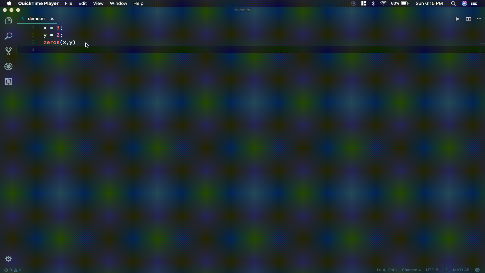

# MATLAB Selection Runner for Visual Studio Code

This extension gives Visual Studio Code the ability to run selected MATLAB code and show the output in a terminal window.

# Demo

# Setup
1. In settings, find 'matlab-runner.matlabPath' and set it to the location of the matlab executable.
For example (mac): '/Applications/MATLAB_R2017b/bin/matlab'
2. Create an empty matlab file ('something'.m) and save it
3. In settings, find 'matlab-runner.tempFilePath' and set it to the location of the file you just created. For example (mac): '/Users/username/Documents/temp.m'

# Using MATLAB Runner
While working on a MATLAB file, highlight the code you want to run, open the command palette to search 'Matlab: Run Selection', and execute the command.

The first time the command is executed it will open a new terminal for matlab which will take a few seconds, but each following execution will be instant.

